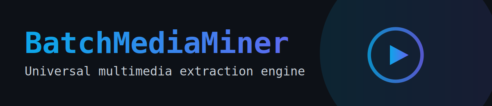

  

# BatchMediaMiner  
Wszechstronny downloader multimediów z wielowątkowością, kolejką pobierania, konwersją audio, obsługą playlist i graficznym interfejsem użytkownika.  
Program pozwala pobierać materiały z YouTube w formacie audio (MP3) lub video (MP4), z wyborem jakości i automatycznym tagowaniem plików.

---

## 🚀 Czym jest BatchMediaMiner?

BatchMediaMiner to narzędzie stworzone z myślą o wygodnym i szybkim pobieraniu wielu filmów lub utworów naraz.  
Program działa jak „koparka multimediów” — zarządza kolejką, pobiera pliki równolegle, konwertuje je oraz porządkuje wyniki.

Jest to graficzna aplikacja napisana w Pythonie (Tkinter + yt-dlp + ffmpeg).

---

## 🎯 Najważniejsze funkcje

### ✔ Pobieranie z YouTube:
- pojedyncze filmy  
- playlisty (automatyczne rozwijanie i kolejkowanie)  
- audio lub video  

### ✔ Audio MP3:
- wybór bitrate: 96–320 kbps  
- dynamiczny slider z podglądem wartości  
- automatyczne tagowanie MP3 (ID3)

### ✔ Video MP4:
- najlepsza dostępna jakość  
- łączenie dźwięku i obrazu (ffmpeg)

### ✔ Zaawansowany menedżer pobierania:
- kolejka z pełnymi informacjami  
- wielowątkowe pobieranie  
- pauzowanie  
- wznawianie  
- procentowy postęp  
- logi w czasie rzeczywistym  
- informacja o statusie każdego zadania

### ✔ System wykrywania ffmpeg:
- automatyczne sprawdzanie, czy ffmpeg jest dostępny  
- poprawne konwertowanie audio/video

### ✔ Przygotowanie pod przyszłe rozszerzenia:
Struktura programu umożliwia późniejsze rozszerzenie o:
- TikTok  
- SoundCloud  
- Twitch  
- Twitter/X  
- pobieranie miniatur  
- tryb automatycznych aktualizacji  

---

## 🖥️ Interfejs użytkownika (GUI)

Program oferuje czytelny graficzny interfejs:
- pole na URL  
- wybór trybu pobierania (audio / video / playlist)  
- suwak bitrate MP3  
- lista zadań z postępem  
- osobny pasek dla aktualnie zaznaczonego zadania  
- przyciski: Dodaj, Start/Wznów, Pauza, Usuń  
- okno logów z podglądem działania

GUI jest responsywne i pracuje na osobnych wątkach, dzięki czemu aplikacja nie zacina się podczas pobierania.

## License
This project is licensed under the **Creative Commons BY-NC-ND 4.0** license.

You are free to:
- **Share** — copy and redistribute the material in any medium or format

Under the following terms:
- **BY (Attribution)** — you must credit the original author (BatchMediaMiner).
- **NC (NonCommercial)** — you may not use the material for commercial purposes.
- **ND (NoDerivatives)** — you may not modify, remix, transform, or build upon the material.

Full license text:  
https://creativecommons.org/licenses/by-nc-nd/4.0/legalcode
